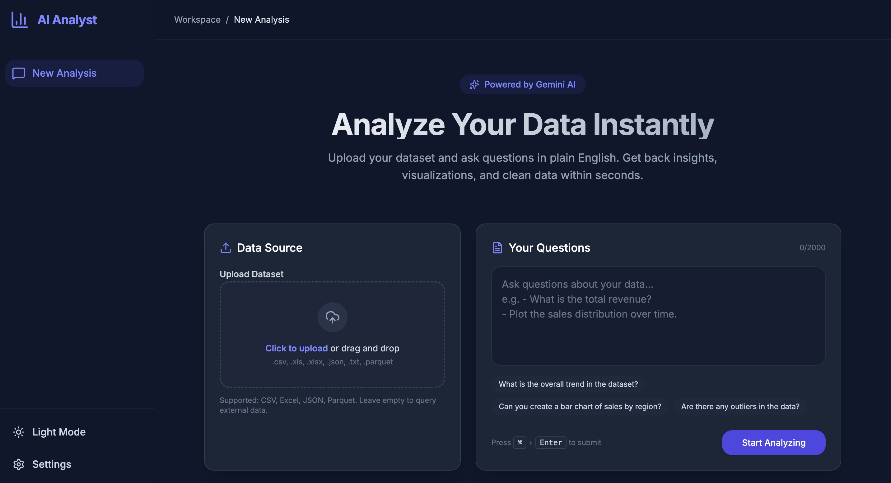

# 🤖 AI Data Analyst Agent

A powerful, autonomous data analyst that answers complex queries on your datasets using Gemini AI and pandas, packaged with a beautiful, modern React frontend.



## ✨ Features

- **Conversational Interface**: Ask complex analytical questions in plain English.
- **Data Visualizations**: Automatically generated, perfectly scaled charts and graphs.
- **Code Highlights**: Cleanly formatted code snippets and raw data structures.
- **Drag & Drop**: Intuitive file upload zone for CSV, Excel, JSON, and Parquet.
- **Markdown Support**: Richly formatted AI responses including tables and bullet points.
- **Dark/Light Mode**: Smooth theme toggling that persists.
- **Instant Copy/Download**: One-click actions to copy text or download charts.

## 🏗️ Architecture

This project is built using a decoupled client-server architecture:

- **Frontend (React + Vite)**: A modern, responsive SPA built with React 18, Tailwind CSS v4, and Framer Motion. Runs locally on port 3000.
- **Backend (FastAPI)**: A Python API that orchestrates the LangChain agent, safely executes generated Python code, and handles Gemini API interactions. Runs locally on port 8000.

The frontend proxies all `/api` requests to the FastAPI backend during development, ensuring seamless communication without CORS issues.

## 📁 Folder Structure

```
.
├── frontend/                  # React Application
│   ├── src/
│   │   ├── components/        # Reusable UI elements
│   │   │   ├── features/      # Complex feature components
│   │   │   ├── layouts/       # Page layouts (Dashboard)
│   │   │   └── ui/            # Primitive components (Button, Card)
│   │   ├── pages/             # Route components
│   │   ├── services/          # API integration layer
│   │   └── utils/             # Helper functions (Tailwind merge)
│   ├── index.html             # Vite entry template
│   └── vite.config.ts         # Vite configuration & proxy settings
│
├── app.py                     # Main FastAPI server and AI agent logic
├── requirements.txt           # Python dependencies
└── ...
```

## 🛠️ Tech Stack

**Frontend**
- React 18
- TypeScript
- Tailwind CSS v4
- Framer Motion
- Lucide React (Icons)
- React Markdown

**Backend**
- Python 3.9+
- FastAPI
- LangChain & Google GenAI
- Pandas, Matplotlib, Seaborn

## ⚙️ Installation & Setup

### Prerequisites
- Node.js v18+ and npm
- Python 3.9+
- A Google Gemini API Key

### Backend Setup

1. Clone the repository and navigate to the root directory.
2. Create and activate a Python virtual environment (optional but recommended).
3. Install Python dependencies:
   ```bash
   pip install -r requirements.txt
   ```
4. Create a `.env` file in the root directory and add your API keys:
   ```env
   gemini_api_1=your_api_key_here
   # Optional: gemini_api_2, gemini_api_3 for load balancing
   ```

### Frontend Setup

1. Navigate to the `frontend` directory:
   ```bash
   cd frontend
   ```
2. Install Node dependencies:
   ```bash
   npm install
   ```

## 🚀 Running Locally

You'll need two terminal windows open.

**Terminal 1 (Backend)**
```bash
# In the project root
uvicorn app:app --reload --port 8000
```

**Terminal 2 (Frontend)**
```bash
# In the /frontend directory
npm run dev
```

Navigate to [http://localhost:5173](http://localhost:5173) (or whatever port Vite assigns) in your browser to use the application!

## 📡 API Integration

The frontend communicates with the backend via a single endpoint:

**`POST /api`**
- **Content-Type**: `multipart/form-data`
- **Payload**:
  - `questions_file` (File, required): A `.txt` file containing the user's questions. (The React frontend generates this file in memory from the textarea input).
  - `data_file` (File, optional): The dataset to analyze (CSV, JSON, Parquet, Excel).
- **Response**: A JSON object where keys are the original questions and values are the generated answers (text, JSON, or base64 images).

## 🚧 Future Improvements
- Add conversation history persistence (local storage or database).
- Implement interactive, web-native charts (e.g., Recharts) instead of static images.
- Create more pages (Settings, Documentation, User Profile).

## 📄 License
This project is licensed under the MIT License.